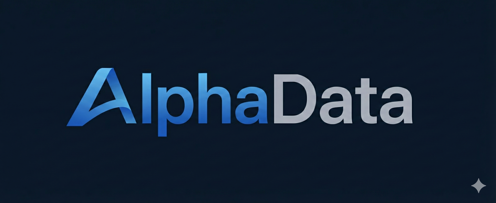

<h1 align="center">

<span style="font-size:46px; vertical-align:middle;">Alphora</span>
</h1>

<p align="center">
  
  
  
</p>

<p align="center">
<strong>构建可组合 AI Agent 的生产级框架</strong>
</p>

<p align="center">
轻松构建强大、模块化且易于维护的 AI Agent 应用。
</p>

<p align="center">
<a href="docs/ARCHITECTURE.md">文档</a> •
<a href="#快速上手">快速上手</a> •
<a href="#示例">示例</a> •
<a href="README.md">English</a>
</p>

---

## 什么是 Alphora?

Alphora 是一个用于构建生产级 AI Agent 的全栈框架。它提供了一切你所需要的核心功能：Agent 编排、提示词工程、工具执行、记忆管理、流式输出以及部署——所有功能都采用异步优先、兼容 OpenAI 的设计。

```python
from alphora.agent import ReActAgent
from alphora.models import OpenAILike
from alphora.sandbox import Sandbox
from alphora.tools import tool

@tool
def search_database(query: str) -> str:
    """查询产品数据库。"""
    return f"为 {query} 找到了 3 条结果"


sandbox = Sandbox.create_docker()

agent = ReActAgent(
    llm=OpenAILike(model_name="gpt-4"),
    tools=[search_database],
    system_prompt="你是一个得力的助手。",
    sandbox=sandbox
)

response = await agent.run("查找 1000 美元以下的笔记本电脑")

```

## 安装

```bash
pip install alphora

```

---

## 核心特性

Alphora 为构建复杂的 AI Agent 提供了丰富的功能：

### Agent 系统

* **Agent 派生** — 子 Agent 继承父级的 LLM、记忆和配置。构建可共享上下文的层级结构。
* **ReAct 循环** — 内置推理-动作循环，具备自动工具编排、重试逻辑和迭代控制。
* **流式优先** — 原生异步流式传输，采用 OpenAI SSE 格式。支持多种内容类型：`char`（字符）、`think`（思考）、`result`（结果）、`sql`、`chart`（图表）。
* **调试追踪** — 内置可视化调试器，用于追踪 Agent 执行流、LLM 调用和工具调用。

### 模型层

* **OpenAI 兼容** — 兼容任何 OpenAI 标准的 API：GPT, Claude, Qwen, DeepSeek 以及本地模型。
* **多模态支持** — 统一的 `Message` 类，支持文本、图像、音频和视频输入。
* **负载均衡** — 内置多个 LLM 后端之间的轮询/随机负载均衡。
* **思考模式** — 支持推理模型（如 Qwen3 等），具有独立的思考流和内容流。
* **嵌入 (Embedding) API** — 统一的文本嵌入接口，支持批量处理。

### 工具系统

* **零配置工具** — `@tool` 装饰器根据类型提示（Type Hints）和文档字符串自动生成 OpenAI 函数调用 Schema。
* **类型安全** — 对所有工具参数进行 Pydantic V2 校验。自动向 LLM 返回错误反馈。
* **原生异步** — 异步工具原生运行；同步工具自动在线程池中执行。
* **并行执行** — 并发执行多个工具调用以提升性能。
* **实例方法** — 支持将类方法注册为工具，并可访问 `self` 上下文（如数据库连接、用户状态等）。

### 提示词引擎

* **Jinja2 模板** — 动态提示词，支持变量插值、条件判断、循环和引用。
* **长文本续写** — 自动检测截断并继续生成，突破 Token 限制。
* **并行提示词** — 使用 `ParallelPrompt` 并发执行多个提示词任务。
* **后处理器** — 通过可插拔的处理器流水线转换流式输出。
* **模板文件** — 从外部文件加载提示词，便于组织和管理。

### 记忆与存储

* **会话记忆** — 多会话管理，完整支持 OpenAI 消息格式。
* **工具调用追踪** — 完整的函数调用链管理及校验。
* **置顶/标签系统** — 保护重要消息不被裁剪或修改。
* **撤销/重做** — 在需要时回滚对话操作。
* **多种后端** — 提供内存、JSON 文件、SQLite 存储选项。
* **TTL 支持** — 自动清理过期会话，支持生存时间设置。

### 沙箱

* **安全执行** — 在隔离环境中运行 Agent 生成的代码。
* **文件隔离** — 沙箱化文件系统，确保文件操作安全。
* **资源监控** — 监控并限制计算资源使用。

### 部署

* **单行 API** — 使用 `publish_agent_api()` 将任何 Agent 发布为兼容 OpenAI 的 REST API。
* **FastAPI 集成** — 基于 FastAPI 构建，自动生成 OpenAPI 文档。
* **SSE 流式传输** — 使用服务器发送事件（SSE）实现实时流式响应。
* **会话管理** — 内置会话处理，支持可配置的 TTL。

---

## 快速上手

### 1. 基础 Agent

```python
from alphora.agent import BaseAgent
from alphora.models import OpenAILike

agent = BaseAgent(llm=OpenAILike(model_name="gpt-4"))

prompt = agent.create_prompt(
    system_prompt="你是一个得力的助手。",
    user_prompt="{{query}}"
)

response = await prompt.acall(query="什么是 Python?")

```

### 2. 使用 @tool 装饰器定义工具

```python
from alphora.tools import tool, ToolRegistry, ToolExecutor

@tool
def get_weather(city: str, unit: str = "celsius") -> str:
    """获取指定城市的当前天气。"""
    return f"{city} 的天气：22°{unit[0].upper()}, 晴"

@tool
async def search_docs(query: str, limit: int = 5) -> list:
    """搜索内部文档。"""
    return [{"title": "结果 1", "score": 0.95}]

registry = ToolRegistry()
registry.register(get_weather)
registry.register(search_docs)

# 获取兼容 OpenAI 的工具 Schema
tools_schema = registry.get_openai_tools_schema()

```

### 3. ReAct Agent (自动工具循环)

```python
from alphora.agent import ReActAgent

agent = ReActAgent(
    llm=llm,
    tools=[get_weather, search_docs],
    system_prompt="你是一个得力的助手。",
    max_iterations=10
)

# Agent 自动处理工具调用循环
result = await agent.run("东京的天气怎么样？")

```

### 4. Agent 派生 (共享上下文)

```python
from alphora.agent import BaseAgent
from alphora.memory import MemoryManager

# 拥有共享资源的父级
parent = BaseAgent(
    llm=llm,
    memory=MemoryManager(),
    config={"project": "demo"}
)

# 子级继承 llm, memory, config
researcher = parent.derive(ResearchAgent)
analyst = parent.derive(AnalysisAgent)

# 所有 Agent 共享同一个记忆库
parent.memory.add_user(session_id="s1", content="你好")
# researcher 和 analyst 都能看到这条消息

```

### 5. 多模态消息

```python
from alphora.models.message import Message

# 创建多模态消息
msg = Message()
msg.add_text("这张图片里有什么？")
msg.add_image(base64_data, format="png")

response = await llm.ainvoke(msg)

```

### 6. 负载均衡

```python
# 主 LLM
llm1 = OpenAILike(model_name="gpt-4", api_key="key1", base_url="https://api1.com/v1")

# 备用 LLM
llm2 = OpenAILike(model_name="gpt-4", api_key="key2", base_url="https://api2.com/v1")

# 合合并并自动实现负载均衡
llm = llm1 + llm2

response = await llm.ainvoke("你好")  # 自动轮询执行

```

### 7. 记忆管理

```python
from alphora.memory import MemoryManager

memory = MemoryManager()

# 添加对话
memory.add_user(session_id="user_123", content="你好")
memory.add_assistant(session_id="user_123", content="你好！")

# 添加工具结果
memory.add_tool_result(session_id="user_123", result=tool_output)

# 为 LLM 构建历史记录
history = memory.build_history(session_id="user_123")

```

### 8. 部署为 API

```python
from alphora.server import publish_agent_api, APIPublisherConfig

config = APIPublisherConfig(
    path="/chat",
    api_title="我的 Agent API",
    memory_ttl=3600
)

app = publish_agent_api(agent=agent, method="run", config=config)

# 运行: uvicorn main:app --port 8000

```

```bash
curl -X POST http://localhost:8000/chat/v1/chat/completions \
  -H "Content-Type: application/json" \
  -d '{"messages": [{"role": "user", "content": "你好！"}], "stream": true}'

```

---

## 示例

| 示例 | 描述 |
| --- | --- |
| [ChatExcel](https://www.google.com/search?q=./examples/chatexcel) | 具备沙箱代码执行能力的数据分析 Agent |
| [RAG Agent](https://www.google.com/search?q=./examples/rag-agent) | 结合向量搜索的检索增强生成 Agent |
| [多 Agent](https://www.google.com/search?q=./examples/multi-agent) | 采用 Agent-as-tool 模式的分层 Agent |
| [流式对话](https://www.google.com/search?q=./examples/streaming-chat) | 具备思考模式的实时对话 |

---

## 配置

```bash
# 环境变量
export LLM_API_KEY="your-api-key"
export LLM_BASE_URL="https://api.openai.com/v1"
export DEFAULT_LLM="gpt-4"

# 可选：Embedding
export EMBEDDING_API_KEY="your-key"
export EMBEDDING_BASE_URL="https://api.openai.com/v1"

```

```python
# 编程式配置
from alphora.models import OpenAILike

llm = OpenAILike(
    model_name="gpt-4",
    api_key="sk-xxx",
    base_url="https://api.openai.com/v1",
    temperature=0.7,
    max_tokens=4096,
    is_multimodal=True  # 启用视觉能力
)

```

## 文档

关于系统设计、组件关系和实现模式的详细信息，请参阅 [架构指南](https://www.google.com/search?q=./docs/ARCHITECTURE.md)。

### 组件概览

| 组件 | 描述 |
| --- | --- |
| [Agent](https://www.google.com/search?q=docs/components/cn/agent_readme.md) | 核心 Agent 生命周期、派生、ReAct 循环 |
| [Prompter](https://www.google.com/search?q=docs/components/cn/prompter_readme.md) | Jinja2 模板、LLM 调用、流式传输 |
| [Models](https://www.google.com/search?q=docs/components/cn/model_readme.md) | LLM 接口、多模态、负载均衡 |
| [Tools](https://www.google.com/search?q=docs/components/cn/tool_readme.md) | tool 装饰器、注册表、并行执行 |
| [Memory](https://www.google.com/search?q=docs/components/cn/memory_readme.md) | 会话管理、历史记录、置顶/标签系统 |
| [Storage](https://www.google.com/search?q=docs/components/cn/storage_readme.md) | 持久化后端 (内存, JSON, SQLite) |
| [Sandbox](https://www.google.com/search?q=docs/components/cn/sandbox_readme.md) | 安全的代码执行环境 |
| [Server](https://www.google.com/search?q=docs/components/cn/server_readme.md) | API 发布、SSE 流式传输 |
| [Postprocess](https://www.google.com/search?q=docs/components/cn/postprocess_readme.md) | 流式转换流水线 |

---

## 贡献者

由 AlphaData 团队精心打造。

<table><tr><td align="center" width="170px"><a href="https://github.com/tian-cmcc"><br /><b>Tian Tian</b></a><br /><sub>项目负责人 & 核心开发</sub><br /><a href="mailto:tiantianit@chinamobile.com" title="Email Tian Tian">📧</a></td><td align="center" width="170px"><a href="https://github.com/yilingliang"><br /><b>Yuhang Liang</b></a><br /><sub>开发者</sub><br /><a href="mailto:liangyuhang@chinamobile.com" title="Email Yuhang Liang">📧</a></td><td align="center" width="170px"><a href="https://github.com/jianhuishi"><br /><b>Jianhui Shi</b></a><br /><sub>开发者</sub><br /><a href="mailto:shijianhui@chinamobile.com" title="Email Jianhui Shi">📧</a></td><td align="center" width="170px"><a href="https://github.com/liuyingdi2025"><br /><b>Yingdi Liu</b></a><br /><sub>开发者</sub><br /><a href="mailto:liuyingdi@chinamobile.com" title="Email Yingdi Liu">📧</a></td><td align="center" width="170px"><a href="https://github.com/hqy479"><br /><b>Qiuyang He</b></a><br /><sub>开发者</sub><br />-</td></tr><tr><td align="center" width="170px"><a href="https://github.com/ljx139"><br /><b>LiuJX</b></a><br /><sub>开发者</sub><br />-</td><td align="center" width="170px"><a href="https://github.com/Cjdddd"><br /><b>Cjdddd</b></a><br /><sub>开发者</sub><br /><a href="mailto:cuijindong@chinamobile.com" title="Email Cjdddd">📧</a></td><td align="center" width="170px"><a href="https://github.com/wwy99"><br /><b>Weiyu Wang</b></a><br /><sub>开发者</sub><br /><a href="mailto:wangweiyu@chinamobile.com" title="Email Weiyu Wang">📧</a></td><td align="center" width="170px"></td><td align="center" width="170px"></td></tr></table>

## 开源协议

本项目遵循 **Apache License 2.0** 协议。

详情请参阅 [LICENSE](https://www.google.com/search?q=./LICENSE)。

贡献代码前需要签署 [贡献者许可协议 (CLA)](https://www.google.com/search?q=CLA.md)。

---

我已为您完成了 README 的翻译，并在顶部的 Python、License 和 PRs 徽章上添加了对应的英文链接。如果您需要我为您生成此项目的架构图或者其他文档，请随时告诉我。