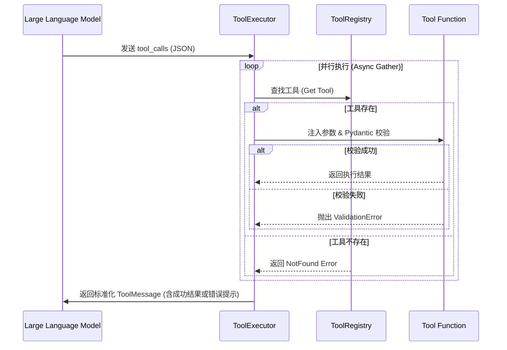

# Alphora Tools System


## 🌟 核心特性

* **类型安全 (Type Safety)**: 基于 `Pydantic V2`，自动进行参数验证与类型转换。
* **零胶水代码 (Zero Boilerplate)**: 使用 `@tool` 装饰器，自动从函数签名和文档字符串生成 JSON Schema。
* **异步优先 (Async First)**: 原生支持 `async/await`，且能自动将同步工具放入线程池运行，绝不阻塞 Event Loop。
* **错误反馈闭环 (Error Feedback Loop)**: 自动捕获参数校验错误和运行时异常，将其格式化为自然语言反馈给大模型，触发模型的自我修正能力。
* **实例方法支持**: 完美支持类实例方法（Bound Methods），便于工具访问数据库连接或用户上下文。

## 🏗 架构设计



## 🚀 快速开始

### 1. 定义工具

```python
from alphora.tools import tool, ToolRegistry, ToolExecutor
import asyncio

# 初始化注册表
registry = ToolRegistry()

# 方式一：简单装饰器 (利用 Type Hints)
@tool
def calculate_tax(amount: float, rate: float = 0.1):
    """
    根据金额和税率计算税费。
    """
    return amount * rate

# 方式二：异步工具 + 自定义名称
@tool(name="weather_tool")
async def get_weather(city: str):
    """查询天气情况"""
    await asyncio.sleep(0.1) # 模拟 IO
    return f"{city} 天气晴朗"

# 注册工具
registry.register(calculate_tax)
registry.register(get_weather)

```

### 2. 获取 Schema 给大模型

```python
# 直接生成符合 OpenAI / DashScope 标准的 tools 列表
llm_tools = registry.get_openai_tools_schema()

# client.chat.completions.create(..., tools=llm_tools)

```

### 3. 执行工具 (Executor)

```python
executor = ToolExecutor(registry)

# 模拟大模型的响应 (tool_calls)
mock_calls = [
    {
        "id": "call_1",
        "function": {"name": "calculate_tax", "arguments": '{"amount": 100}'}
    },
    {
        "id": "call_2",
        "function": {"name": "weather_tool", "arguments": '{"city": "Beijing"}'}
    }
]

# 自动并行执行
results = await executor.execute(mock_calls)

# results 包含标准化的 role='tool' 消息，可直接追加到 history 中
print(results) 

```

## 🛠 高级用法

### 绑定类方法 (Stateful Tools)

适用于需要访问数据库、API Key 或用户 Session 的场景。

```python
class DatabaseService:
    def __init__(self, db_url: str):
        self.db_url = db_url

    def query_user(self, user_id: int):
        """查询用户数据库"""
        return f"User {user_id} from {self.db_url}"

db = DatabaseService("postgres://...")

# 注册时会自动处理 self 参数，大模型无需感知
registry.register(db.query_user, name_override="lookup_user")

```

### 严格模式与 Pydantic 模型

如果你需要更复杂的参数验证（如正则表达式、枚举），可以显式定义 Pydantic 模型。

```python
from pydantic import BaseModel, Field

class SearchInput(BaseModel):
    query: str = Field(..., min_length=3)
    category: str = Field("general", pattern="^(news|blog|general)$")

@tool(args_schema=SearchInput)
def advanced_search(query: str, category: str):
    """执行高级搜索"""
    return f"Searching {query} in {category}"

```

### 处理重名冲突

为了防止工具被静默覆盖，Registry 会在重名时抛出异常。

```python
def my_func(): pass

registry.register(my_func)
# registry.register(my_func)  # Raises ToolRegistrationError

# 解决方法：使用 name_override
registry.register(my_func, name_override="my_func_v2")

```

## ⚠️ 错误处理机制

内置了三层容错机制，确保 Agent 运行时的稳定性：

1. **ToolNotFoundError**: 大模型调用了不存在的工具 -> 返回明确错误提示。
2. **ToolValidationError**: 参数类型错误或缺失 -> 返回 Pydantic 详细报错，**引导大模型重试**。
3. **ToolExecutionError**: 函数内部运行时崩溃 -> 捕获 Traceback 并返回错误摘要，防止进程退出。
